# TaskHub API — FastAPI zero to hero

A production-style task management REST API that demonstrates most of FastAPI's
feature surface in a realistic, layered architecture. Users register and log in,
create **projects**, fill them with **tasks**, and attach **files** to tasks.
Admins manage users; members only ever see their own data.

## Stack

· FastAPI 
· SQLAlchemy 2.0 (async) 
· Alembic 
· Pydantic v2 + pydantic-settings 
· PyJWT + Argon2 (pwdlib) 
· structlog 
· pytest + httpx 
· uv 
· Docker/Postgres


## Project Structure

```
fastapi-zero-to-hero
├── Dockerfile
├── README.md
├── alembic
├── alembic.ini
├── api-documentation.png
├── app
├── docker-compose.yml
├── pyproject.toml
├── taskhub.db
├── tests
├── uploads
└── uv.lock
```

## Running the Project

You can run TaskHub using a manual local process, Docker Compose, or Kubernetes.

### 1. Manual Process (Local Development)

#### Quick Start with SQLite
This is the simplest way to get up and running without setting up external databases:
```bash
# 1. Create and activate a virtual environment
uv venv
source .venv/bin/activate  # On Windows use: .venv\Scripts\activate

# 2. Install dependencies
uv sync

# 3. Copy example environment file
cp .env.example .env

# 4. Run database migrations (this creates the local sqlite file ./taskhub.db)
uv run alembic upgrade head

# 5. Start the FastAPI development server
uv run uvicorn app.main:app --reload
```
Open [http://localhost:8000/docs](http://localhost:8000/docs) (Swagger UI) or `/redoc` in your browser. Register via `POST /api/v1/auth/register`, log in via `POST /api/v1/auth/login`, then use Swagger's **Authorize** button with the access token.


#### Running with PostgreSQL
If you want to run the application manually but connect to a PostgreSQL database instead of SQLite:
1. Ensure you have a running PostgreSQL instance (with database name, user, and password set).
2. Configure `.env` with your Postgres connection details (refer to [app/core/config.py](file:///Users/sany/Projects/fastapi-zero-to-hero/app/core/config.py) for the schema):
   ```env
   DATABASE_HOST=localhost
   DATABASE_PORT=5432
   DATABASE_NAME=taskhub
   DATABASE_USER=taskhub
   DATABASE_PASSWORD=your_password
   ```
3. Run migrations and start the server:
   ```bash
   uv run alembic upgrade head
   uv run uvicorn app.main:app --reload
   ```

To make a user an admin (roles can't be self-assigned):
```bash
uv run python -c "
import asyncio, sqlalchemy as sa
from app.db.session import engine
async def main():
    async with engine.begin() as c:
        await c.execute(sa.text(\"UPDATE users SET role='admin' WHERE email='you@example.com'\"))
asyncio.run(main())"
```

### 2. Docker (Docker Compose)
To run the full stack (FastAPI app + PostgreSQL database) inside containers:
```bash
# Generate a secret key and boot the stack
SECRET_KEY=$(python3 -c 'import secrets; print(secrets.token_urlsafe(64))') docker compose up --build
```
This command:
- Starts a PostgreSQL database container.
- Builds the FastAPI application Docker image.
- Performs Alembic migrations on startup.
- Exposes the application on [http://localhost:8000](http://localhost:8000).

To shut down the stack:
```bash
docker compose down -v
```

### 3. Kubernetes (Docker Desktop / AWS EC2)
For production-grade deployments, Kubernetes configurations are provided in the [fastapi-on-k8s](file:///Users/sany/Projects/fastapi-zero-to-hero/fastapi-on-k8s) directory.

1. **Navigate to the Kubernetes folder**:
   ```bash
   cd fastapi-on-k8s
   ```
2. **Review the deployment guide**: Read the detailed instructions in [fastapi-on-k8s/README.md](file:///Users/sany/Projects/fastapi-zero-to-hero/fastapi-on-k8s/README.md).
3. **Deploy the stack**:
   - Create namespace, secrets, configmap, and persistent volume claim:
     ```bash
     kubectl apply -f namespace.yaml
     kubectl apply -f secret.yaml
     kubectl apply -f configmap.yaml
     kubectl apply -f postgres/
     ```
   - Run the database migrations job:
     ```bash
     kubectl apply -f api/migration-job.yaml
     ```
   - Deploy the API, service, and HPA:
     ```bash
     kubectl apply -f api/deployment.yaml
     kubectl apply -f api/service.yaml
     kubectl apply -f api/hpa.yaml
     ```
4. **Access the application**:
   - **Local Development**: Forward traffic to your localhost:
     ```bash
     kubectl port-forward svc/api 8000:8000 -n taskhub
     ```
     Open [http://localhost:8000/docs](http://localhost:8000/docs).
   - **AWS EC2**: Access directly using port `30080` (NodePort):
     `http://<EC2_PUBLIC_IP>:30080/docs`


## Tests

```bash
uv run pytest            # 54 tests: auth, RBAC, CRUD, filtering, uploads…
uv run ruff check .      # lint
```

Tests run against in-memory SQLite with the DB dependency overridden — no
external services needed.

## Architecture

```mermaid
flowchart TB
    subgraph Client
        A["🌐 HTTP Client<br/>(Browser / curl / SDK)"]
    end

    subgraph Middleware["Middleware Chain (outermost → innermost)"]
        direction TB
        M1["CORSMiddleware<br/>Origin / preflight checks"]
        M2["TrustedHostMiddleware<br/>Host-header validation"]
        M3["GZipMiddleware<br/>Response compression ≥ 1 KB"]
        M4["RequestContextMiddleware<br/>Assigns request_id, logs timing"]
        M5["RateLimitMiddleware<br/>Global per-IP sliding window"]
        M1 --> M2 --> M3 --> M4 --> M5
    end

    subgraph FastAPI["FastAPI Application"]
        direction TB

        subgraph DI["Dependency Injection (app/api/deps.py)"]
            D1["OAuth2 Bearer → decode JWT"]
            D2["get_current_user → load User from DB"]
            D3["require_roles → RBAC guard"]
            D4["get_pagination → page / page_size"]
            D5["Service Factories<br/>AuthService · UserService<br/>ProjectService · TaskService"]
            D1 --> D2 --> D3
        end

        subgraph Routes["Routes (app/api/v1/routes/)"]
            R1["auth.py<br/>register · login · refresh"]
            R2["projects.py<br/>CRUD + soft-delete/restore"]
            R3["tasks.py<br/>CRUD + attachments"]
            R4["users.py<br/>profile · admin mgmt"]
            R5["health.py<br/>/health · /live · /ready · /metrics"]
        end

        subgraph Services["Service Layer (app/services/)"]
            S1["AuthService<br/>hash passwords · issue JWTs"]
            S2["ProjectService<br/>ownership checks · transactions"]
            S3["TaskService<br/>status rules · file uploads"]
            S4["UserService<br/>profile · admin ops"]
            S5["EmailService<br/>background welcome email"]
        end

        subgraph Repos["Repository Layer (app/repositories/)"]
            RP1["BaseRepository<br/>list_paginated: filter +<br/>search + sort + count"]
            RP2["UserRepository"]
            RP3["ProjectRepository"]
            RP4["TaskRepository"]
        end

        subgraph Models["ORM Models (app/models/)"]
            ORM1["User"]
            ORM2["Project"]
            ORM3["Task · TaskAttachment"]
        end
    end

    subgraph DB["Database"]
        PG[("PostgreSQL / SQLite<br/>via SQLAlchemy 2.0 async")]
    end

    subgraph ErrHandling["Global Exception Handling"]
        EH["AppError hierarchy<br/>NotFound · Conflict · Forbidden<br/>Unauthorized · RateLimited · …"]
        ER["Standard JSON Error Envelope<br/>{error: {code, message}, request_id}"]
        EH --> ER
    end

    A -- "HTTP Request" --> M1
    M5 --> Routes
    Routes -- "Depends(...)" --> DI
    DI -- "injects session,<br/>user, services" --> Routes
    Routes --> Services
    Services --> Repos
    Services -- "raises domain<br/>exceptions" --> EH
    Repos --> Models
    Models -- "async queries" --> PG
    PG -- "result rows" --> Models
    Models --> Repos
    Repos --> Services
    Services -- "commit &<br/>return" --> Routes
    Routes -- "Pydantic<br/>response model" --> M5
    M5 --> M4 --> M3 --> M2 --> M1
    M1 -- "HTTP Response" --> A
    ER -. "error response" .-> A

    style Client fill:#1a1a2e,stroke:#e94560,color:#eee
    style Middleware fill:#16213e,stroke:#0f3460,color:#eee
    style FastAPI fill:#0f3460,stroke:#533483,color:#eee
    style DI fill:#1a1a3e,stroke:#e94560,color:#eee
    style Routes fill:#1a1a3e,stroke:#00b4d8,color:#eee
    style Services fill:#1a1a3e,stroke:#48bfe3,color:#eee
    style Repos fill:#1a1a3e,stroke:#90e0ef,color:#eee
    style Models fill:#1a1a3e,stroke:#caf0f8,color:#eee
    style DB fill:#1b2838,stroke:#66c0f4,color:#eee
    style ErrHandling fill:#2d142c,stroke:#e94560,color:#eee
```



- **Routes** validate input with Pydantic schemas and declare response models;
  they never touch the session directly.
- **Services** own commits and raise domain exceptions (`NotFoundError`,
  `ConflictError`, …) that global handlers turn into a standard error envelope.
- **Repositories** are thin generic query helpers (`list_paginated` does
  filter + search + sort + count in one place).

### Standard formats

Every list endpoint returns `{items, total, page, page_size, pages}`.
Every error returns:

```json
{"error": {"code": "not_found", "message": "Project not found"}, "request_id": "…"}
```

## Feature map

| Feature | Where |
|---|---|
| API versioning | `app/api/v1/` mounted at `/api/v1` (`app/main.py`) |
| CRUD + soft delete/restore | `app/api/v1/routes/projects.py`, `tasks.py` |
| Validation (constraints, custom validators, sanitization) | `app/schemas/` (`str_strip_whitespace`, password strength, future `due_date`) |
| Response models / hidden fields | `UserRead` omits `hashed_password` |
| JWT auth (access + refresh, rotation) | `app/core/security.py`, `app/services/auth.py` |
| RBAC + ownership checks | `require_roles` in `app/api/deps.py`; `get_accessible` in services |
| Async SQLAlchemy 2.0, pooling, transactions | `app/db/session.py`, services commit explicitly |
| Alembic migrations (async, autogenerate) | `alembic/` |
| Dependency injection | `app/api/deps.py` (session, settings, current user, services, pagination) |
| Global exception handling, error envelope | `app/core/exceptions.py` |
| Structured logging + request logging | `app/core/logging.py`, `app/middleware/request_context.py` |
| Pagination / filtering / sorting / search | `BaseRepository.list_paginated` + query params on list routes |
| Config management (.env, per-environment) | `app/core/config.py` |
| CORS, trusted hosts, GZip | `app/main.py` |
| Rate limiting (global per-IP + per-endpoint) | `app/middleware/rate_limit.py`, `login_rate_limit` dep |
| OpenAPI docs (tags, summaries, examples, error models) | route decorators throughout |
| Health probes | `/health`, `/live`, `/ready` (DB check) |
| Request ID + timing middleware | `app/middleware/request_context.py` |
| File upload (multipart, type + size limits, streaming) | `TaskService.add_attachment` |
| Background tasks | welcome email in `routes/auth.py` + `app/services/email.py` |
| Metrics endpoint | `/metrics` (`app/utils/metrics.py`) |
| Audit fields, UUID PKs, timestamps | `app/models/mixins.py` |
| Test suite w/ test DB | `tests/` |
| Docker + Compose + prod ASGI server | `Dockerfile`, `docker-compose.yml` |

## Deliberate scope cuts (and how to grow them)

- **Rate limiting & metrics are in-process.** Multi-worker/multi-replica
  deployments need Redis for the limiter and prometheus-client for metrics —
  both are isolated behind single integration points (`SlidingWindowRateLimiter.check`,
  `MetricsCollector.record`).
- **Refresh tokens are stateless** (no server-side revocation list). Add a
  `refresh_tokens` table keyed by `jti` if you need logout-everywhere.
- **Caching** is omitted; add Redis + a cache-aside decorator in services if
  list endpoints get hot.
- **File storage is local disk.** Swap `TaskService.add_attachment` internals
  for S3/GCS; the API contract doesn't change.
