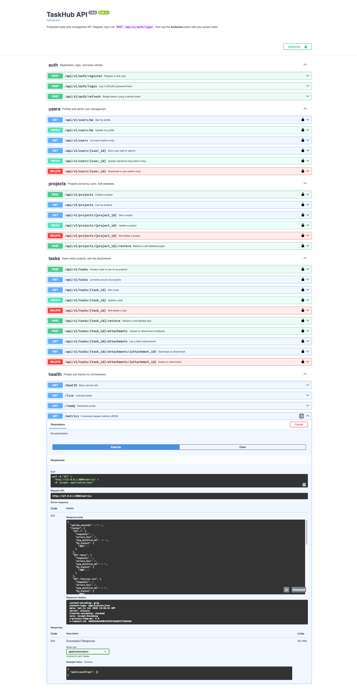

# TaskHub API — FastAPI zero to hero

A production-style task management REST API that demonstrates most of FastAPI's
feature surface in a realistic, layered architecture. Users register and log in,
create **projects**, fill them with **tasks**, and attach **files** to tasks.
Admins manage users; members only ever see their own data.

## Stack

·FastAPI 
· SQLAlchemy 2.0 (async) 
· Alembic 
· Pydantic v2 + pydantic-settings 
· PyJWT + Argon2 (pwdlib) 
· structlog 
· pytest + httpx 
· uv 
· Docker/Postgres


## Project Structure

```
fastapi-zero-to-hero
├── Dockerfile
├── README.md
├── alembic
├── alembic.ini
├── api-documentation.png
├── app
├── docker-compose.yml
├── pyproject.toml
├── taskhub.db
├── tests
├── uploads
└── uv.lock
```

## Quick start (local, SQLite)

```bash
uv venv                        # create virtual environment
source .venv/bin/activate      # activate virtual environment
uv sync                        # install dependencies
cp .env.example .env           # optional — sane defaults are built in
uv run alembic upgrade head    # create the schema (writes ./taskhub.db)
uv run uvicorn app.main:app --reload
```

Open http://localhost:8000/docs (Swagger UI) or `/redoc`. Register via
`POST /api/v1/auth/register`, log in via `POST /api/v1/auth/login`, then use
Swagger's **Authorize** button with the access token.





To make a user an admin (roles can't be self-assigned):

```bash
uv run python -c "
import asyncio, sqlalchemy as sa
from app.db.session import engine
async def main():
    async with engine.begin() as c:
        await c.execute(sa.text(\"UPDATE users SET role='admin' WHERE email='you@example.com'\"))
asyncio.run(main())"
```

## Quick start (Docker, Postgres)

```bash
SECRET_KEY=$(python3 -c 'import secrets; print(secrets.token_urlsafe(64))') docker compose up --build
```

Runs migrations, then serves on http://localhost:8000 with JSON logs.

## Tests

```bash
uv run pytest            # 54 tests: auth, RBAC, CRUD, filtering, uploads…
uv run ruff check .      # lint
```

Tests run against in-memory SQLite with the DB dependency overridden — no
external services needed.

## Architecture

```
Request → middleware (CORS, TrustedHost, GZip, request-id/logging, rate limit)
        → route (app/api/v1/routes/…)      HTTP concerns only
        → service (app/services/…)          business rules, ownership, transactions
        → repository (app/repositories/…)   query building, pagination, soft-delete filter
        → model (app/models/…)              SQLAlchemy tables
```

- **Routes** validate input with Pydantic schemas and declare response models;
  they never touch the session directly.
- **Services** own commits and raise domain exceptions (`NotFoundError`,
  `ConflictError`, …) that global handlers turn into a standard error envelope.
- **Repositories** are thin generic query helpers (`list_paginated` does
  filter + search + sort + count in one place).

### Standard formats

Every list endpoint returns `{items, total, page, page_size, pages}`.
Every error returns:

```json
{"error": {"code": "not_found", "message": "Project not found"}, "request_id": "…"}
```

## Feature map

| Feature | Where |
|---|---|
| API versioning | `app/api/v1/` mounted at `/api/v1` (`app/main.py`) |
| CRUD + soft delete/restore | `app/api/v1/routes/projects.py`, `tasks.py` |
| Validation (constraints, custom validators, sanitization) | `app/schemas/` (`str_strip_whitespace`, password strength, future `due_date`) |
| Response models / hidden fields | `UserRead` omits `hashed_password` |
| JWT auth (access + refresh, rotation) | `app/core/security.py`, `app/services/auth.py` |
| RBAC + ownership checks | `require_roles` in `app/api/deps.py`; `get_accessible` in services |
| Async SQLAlchemy 2.0, pooling, transactions | `app/db/session.py`, services commit explicitly |
| Alembic migrations (async, autogenerate) | `alembic/` |
| Dependency injection | `app/api/deps.py` (session, settings, current user, services, pagination) |
| Global exception handling, error envelope | `app/core/exceptions.py` |
| Structured logging + request logging | `app/core/logging.py`, `app/middleware/request_context.py` |
| Pagination / filtering / sorting / search | `BaseRepository.list_paginated` + query params on list routes |
| Config management (.env, per-environment) | `app/core/config.py` |
| CORS, trusted hosts, GZip | `app/main.py` |
| Rate limiting (global per-IP + per-endpoint) | `app/middleware/rate_limit.py`, `login_rate_limit` dep |
| OpenAPI docs (tags, summaries, examples, error models) | route decorators throughout |
| Health probes | `/health`, `/live`, `/ready` (DB check) |
| Request ID + timing middleware | `app/middleware/request_context.py` |
| File upload (multipart, type + size limits, streaming) | `TaskService.add_attachment` |
| Background tasks | welcome email in `routes/auth.py` + `app/services/email.py` |
| Metrics endpoint | `/metrics` (`app/utils/metrics.py`) |
| Audit fields, UUID PKs, timestamps | `app/models/mixins.py` |
| Test suite w/ test DB | `tests/` |
| Docker + Compose + prod ASGI server | `Dockerfile`, `docker-compose.yml` |

## Deliberate scope cuts (and how to grow them)

- **Rate limiting & metrics are in-process.** Multi-worker/multi-replica
  deployments need Redis for the limiter and prometheus-client for metrics —
  both are isolated behind single integration points (`SlidingWindowRateLimiter.check`,
  `MetricsCollector.record`).
- **Refresh tokens are stateless** (no server-side revocation list). Add a
  `refresh_tokens` table keyed by `jti` if you need logout-everywhere.
- **Caching** is omitted; add Redis + a cache-aside decorator in services if
  list endpoints get hot.
- **File storage is local disk.** Swap `TaskService.add_attachment` internals
  for S3/GCS; the API contract doesn't change.
